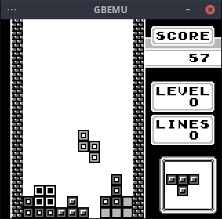
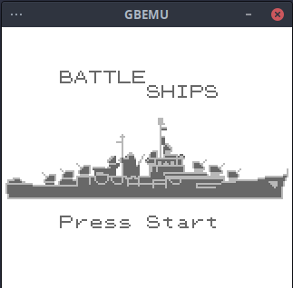

# Gameboy Emulator

Emulator written using C++ for fun.

Here it is playing Tetris



As well as a battleships game I made as part of a hackathon



Development is completed using various resources, including:
- https://gbdev.io/pandocs/
- https://meganesulli.com/generate-gb-opcodes/
- https://gekkio.fi/files/gb-docs/gbctr.pdf

## Building

The project only currently targets Linux, although should be fairly portable to Windows/Mac OS.

Dependencies for the project are `sdl2` as well as `gtest` for the test suite.

### Development
With the dependencies installed and from the repository root run the following commands to build
```
mkdir build
cd build
cmake -S .. -B . -DCMAKE_BUILD_TYPE=Debug
make
```

To run the test suite
```
make test
```
### Release
```
mkdir build
cd build
cmake -S .. -B . -DCMAKE_BUILD_TYPE=Debug
make
```

## Usage
```
gbemu romfile.gb
```
